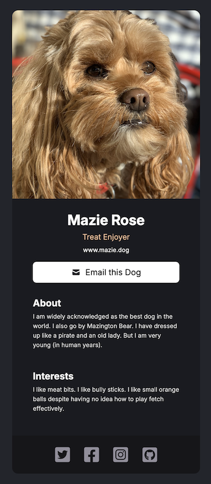

# React Business Card

A simple React business card built for the Scrimba front-end developer path. Used as a learning exercise to practice JSX syntax & React patterns.

## Features

- View a static business card built from React components

## Technologies Used

- HTML
- CSS
- JavaScript
- React
- Vite

## Installation

- `npm install`
- `npm run dev`